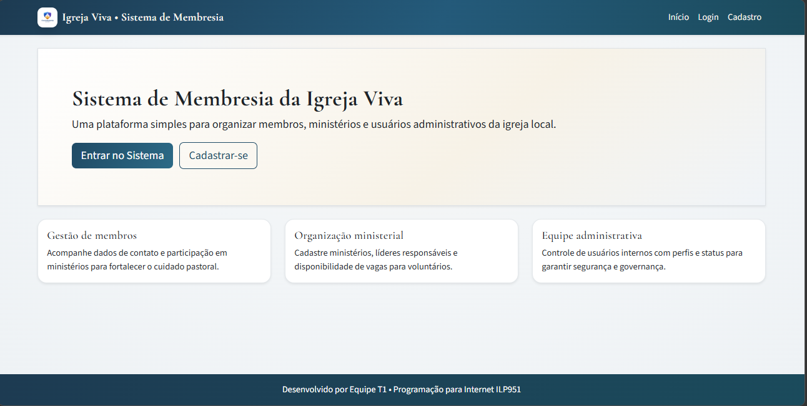
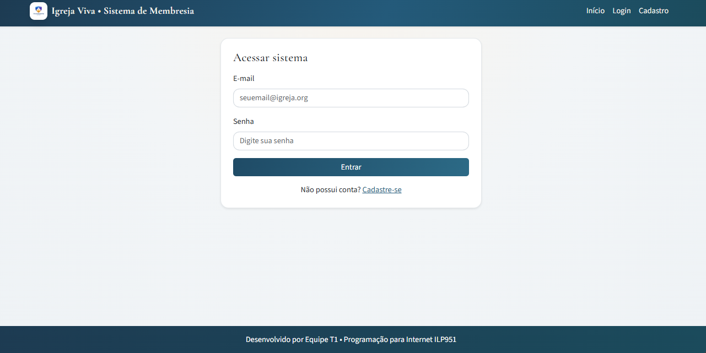
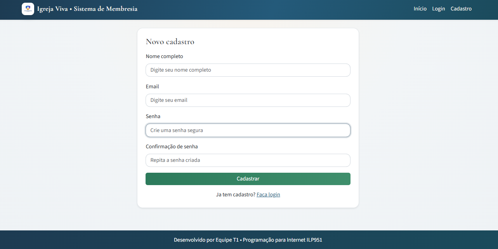
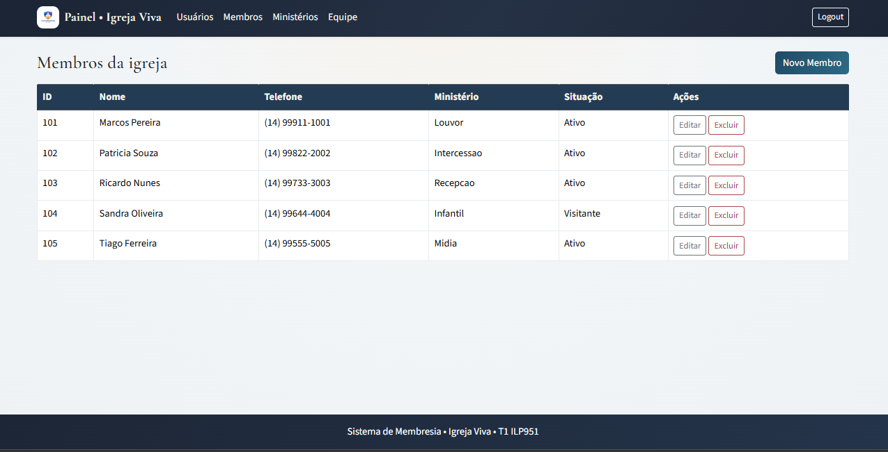
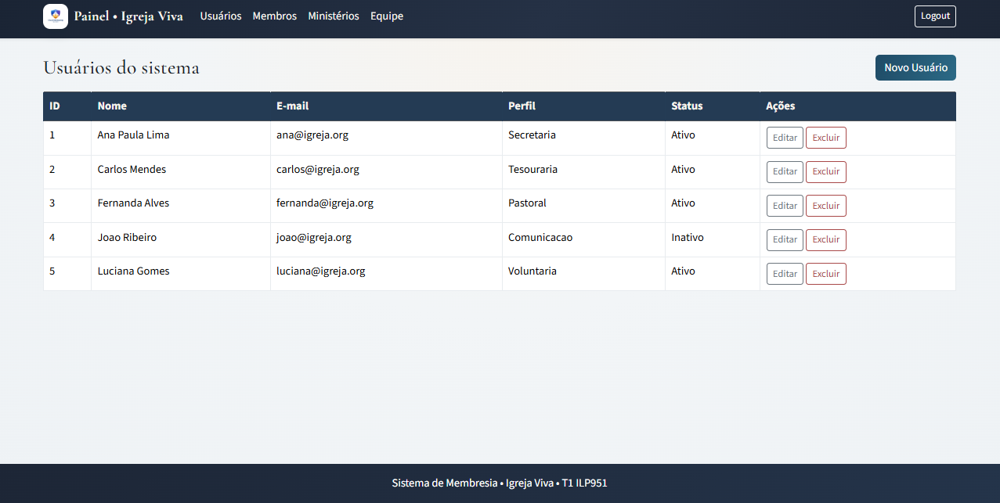
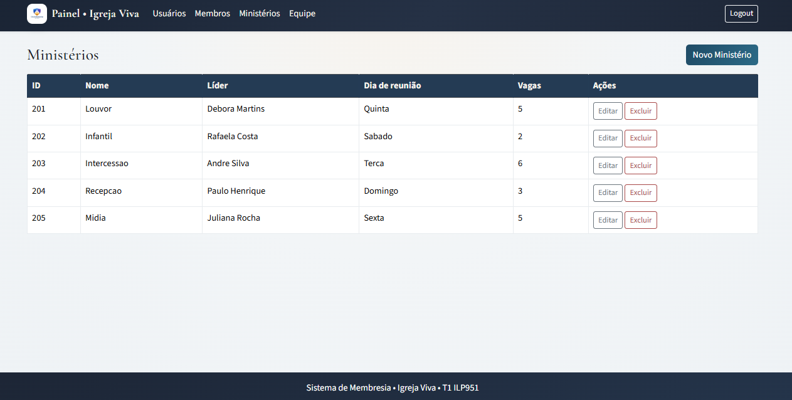
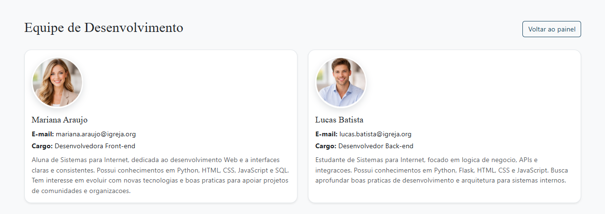

# Sistema de Membresia Church

Projeto web em **Flask** para gestao basica de uma igreja, com foco em:
- autenticacao simples por sessao;
- cadastro e manutencao de **usuarios**, **membros** e **ministerios**;
- interface HTML renderizada no servidor (templates Jinja2);
- armazenamento em memoria (listas Python) para fins didaticos.

> Atenção: este projeto usa armazenamento simulado em memoria (nao usa banco de dados real). Ao reiniciar o servidor, os dados inseridos/alterados voltam ao estado inicial do arquivo `app.py`.

---

## 1) Tecnologias utilizadas

- Python 3
- Flask 3.x
- Jinja2 (templates)
- HTML/CSS/JavaScript

Dependencias definidas em `membresia_church/requirements.txt`.

---

## 2) Estrutura do projeto

```text
membresia_church/
  app.py
  requirements.txt
  static/
    css/styles.css
    js/script.js
    imgs/
  templates/
    base.html
    base_publica.html
    index.html
    login.html
    cadastro.html
    sobre_equipe.html
    usuarios/
    membros/
    ministerios/
README.md
```

---

## 3) Como executar no Windows (PowerShell)

### 3.1 Clonar o repositorio

```powershell
git clone <url-do-repositorio>
cd Programa-o-para-Internet-ILP951
```

### 3.2 Criar e ativar ambiente virtual

```powershell
python -m venv .venv
.venv\Scripts\Activate.ps1
```

Se o PowerShell bloquear a ativacao, rode:

```powershell
Set-ExecutionPolicy -ExecutionPolicy RemoteSigned -Scope CurrentUser
```

### 3.3 Instalar o Flask e dependencias

O Flask ja esta no `requirements.txt`. Instale tudo de uma vez:

```powershell
pip install -r membresia_church\requirements.txt
```

Se quiser instalar apenas o Flask (por exemplo, para testar):

```powershell
pip install Flask
```

### 3.4 Rodar a aplicacao

```powershell
python membresia_church\app.py
```

### 3.5 Acessar no navegador

- URL padrao: `http://127.0.0.1:5000`

---

## 4) Funcionalidades principais

### Area publica
- **Home (`/`)**: pagina inicial.
- **Login (`/login`)**: autenticacao simples por email e senha (sem persistencia real de usuarios).
- **Cadastro (`/cadastro`)**: valida campos obrigatorios e confirmacao de senha.
- **Equipe (`/equipe`)**: pagina informativa da equipe.

### Area autenticada (protegida por sessao)
Ao fazer login, rotas com `@login_required` ficam acessiveis.

#### Usuarios
- Listar usuarios (`/usuarios/listar`)
- Inserir usuario (`/usuarios/inserir`)
- Editar usuario (`/usuarios/editar/<id>`)
- Excluir usuario (`/usuarios/excluir/<id>`)

#### Membros
- Listar membros (`/membros/listar`)
- Inserir membro (`/membros/inserir`)
- Editar membro (`/membros/editar/<id>`)
- Excluir membro (`/membros/excluir/<id>`)

#### Ministerios
- Listar ministerios (`/ministerios/listar`)
- Inserir ministerio (`/ministerios/inserir`)
- Editar ministerio (`/ministerios/editar/<id>`)
- Excluir ministerio (`/ministerios/excluir/<id>`)

#### Sessao
- Logout (`/logout`) limpa sessao e redireciona para login.

---

## 5) Logica por tras do sistema

### 5.1 Modelo de dados (em memoria)
A aplicacao simula um “banco de dados” com listas Python globais:
- `USUARIOS`
- `MEMBROS`
- `MINISTERIOS`

Tambem usa listas auxiliares para opcoes de formularios:
- `PERFIS_USUARIO`
- `SITUACOES_MEMBRO`
- `DIAS_REUNIAO`

### 5.2 Funcoes utilitarias
- `encontrar_por_id(lista, item_id)`: busca item por ID.
- `proximo_id(lista)`: calcula proximo ID incremental.

### 5.3 Controle de acesso
O decorator `login_required` verifica se existe `session["usuario_logado"]`.
Se nao existir, exibe mensagem com `flash` e redireciona para `/login`.

### 5.4 Fluxo de autenticacao
1. Usuario envia email/senha em `/login`.
2. Se campos validos, o email e salvo na sessao.
3. O sistema redireciona para listagem de membros.
4. Rotas protegidas passam a ser acessiveis.
5. Em `/logout`, `session.clear()` encerra autenticacao.

### 5.5 CRUDs
Cada modulo (usuarios, membros, ministerios) segue o mesmo padrao:
1. **Listar**: renderiza template com a lista atual.
2. **Inserir**: valida formulario, monta dicionario, atribui ID e adiciona a lista.
3. **Editar**: encontra item por ID, valida dados e atualiza campos.
4. **Excluir**: encontra item por ID e remove da lista.

### 5.6 Validacoes
- Campos obrigatorios em formularios.
- Conversao e validacao numerica de vagas em ministerios.
- Mensagens de feedback ao usuario com `flash` (sucesso, erro, aviso).

---

## 6) Prints das telas principais

As imagens estao em `membresia_church/static/imgs/`.









---

## 7) Problemas comuns e solucoes

- Erro `UnicodeDecodeError` ao abrir uma pagina:
Verifique se os arquivos em `templates/` estao em UTF-8 sem BOM. Regrave o arquivo e reinicie o servidor.
- Pagina em branco ou erro 500 em templates:
Confira se o nome do template usado na rota existe e se os nomes dos arquivos estao corretos.
- Nao consegue ativar o venv no PowerShell:
Execute `Set-ExecutionPolicy -ExecutionPolicy RemoteSigned -Scope CurrentUser` e tente novamente.
- Dados somem ao reiniciar o servidor:
Este projeto usa listas em memoria. Isso e esperado no modo didatico.

---

## 8) Checklist de entrega (avaliacao)

- [x] README atualizado com instrucoes de execucao
- [x] Estrutura de pastas conforme padrao Flask
- [x] Telas publicas e privadas funcionando
- [x] CRUDs de usuarios, membros e ministerios funcionando
- [x] Validacoes basicas com mensagens de erro
- [x] Estilizacao aplicada (CSS)
- [x] Prints das telas anexados em `membresia_church/static/imgs/`
