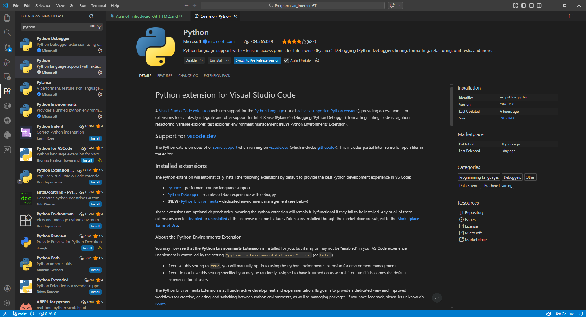

# Aula 01 — Introdução, Git e HTML5

> **Disciplina:** Programação para Internet (ILP951)  
> **Professor:** Ronan Adriel Zenatti  
> **Pré-requisitos:** Nenhum — esta é a aula zero, o ponto de partida absoluto.

---

## 🗺️ O que você vai aprender nesta aula

Nesta primeira aula você vai configurar todo o ambiente de desenvolvimento que usaremos durante o semestre inteiro. Ao final, você terá instalado Python, criado a pasta do projeto, configurado um ambiente virtual, feito seu primeiro commit no GitHub e escrito um arquivo HTML5 válido. Parece muito, mas cada passo é simples quando feito um de cada vez — e é exatamente assim que vamos fazer.

---

## Parte 1 — Entendendo o que vamos construir

Antes de instalar qualquer coisa, vale a pena ter uma imagem clara do que é uma aplicação web e quais peças a compõem. Isso vai ajudar você a entender *por que* cada ferramenta existe e qual papel ela desempenha no conjunto.

### O que é uma aplicação web?

Quando você abre o Google no navegador e digita uma pesquisa, uma sequência de eventos acontece: o navegador envia uma pergunta para um computador que está em algum servidor no mundo, esse computador processa a pergunta, busca as respostas em um banco de dados e devolve uma página HTML para o seu navegador mostrar na tela.

Nessa história existem três personagens principais. O **front-end** é tudo que você vê e clica — os botões, as cores, o texto, o layout. Ele vive no seu navegador e é feito de HTML, CSS e JavaScript. O **back-end** é o "cérebro" da aplicação — o código que roda no servidor, processa as informações, valida os dados e decide o que mostrar. É aqui que entra o Python com Flask. O **banco de dados** é onde as informações são guardadas de forma permanente — usuários cadastrados, produtos, pedidos, tudo fica salvo aqui.


Nesta disciplina você vai aprender a construir as três camadas. Nesta primeira aula, vamos montar a estrutura base e entender o HTML — a fundação de tudo que aparece na tela.

### Por que Python?

Python é atualmente uma das linguagens de programação mais usadas no mundo, tanto em empresas iniciantes quanto em gigantes como Google, Netflix e Instagram. Ela foi escolhida para esta disciplina por três razões concretas: sua sintaxe é muito próxima da linguagem humana (você vai conseguir ler o código e entender o que ele faz antes mesmo de aprender as regras formais), ela tem uma biblioteca chamada Flask que simplifica a criação de aplicações web, e ela é a mesma linguagem usada em áreas de grande crescimento como Inteligência Artificial e Ciência de Dados — o que você aprende aqui abre portas bem além desta disciplina.

---

## Parte 2 — Instalando o Python

### O que é um interpretador e por que precisamos instalá-lo?

Uma linguagem de programação como Python é, em essência, um conjunto de regras e palavras que os humanos podem escrever e entender. O problema é que o computador não entende Python — ele só entende sequências de zeros e uns. O **interpretador Python** é o programa responsável por traduzir o que você escreve em Python para instruções que o processador consegue executar. Instalar o Python significa instalar esse tradutor no seu computador.


### Instalação no Windows

Acesse o site oficial em **python.org** e clique em "Download Python 3.x.x" (a versão mais recente da série 3). Baixe o instalador `.exe` e execute-o.

**Atenção crucial:** Na primeira tela do instalador, antes de clicar em qualquer botão, você verá uma caixa de seleção no rodapé com o texto **"Add Python to PATH"**. Marque essa opção. Se você não marcar ela agora, o Windows não vai saber onde encontrar o Python quando você digitar comandos no terminal, e você terá que configurar manualmente mais tarde. Após marcar, clique em "Install Now".


### Verificando se a instalação funcionou

Após a instalação, abra o **Prompt de Comando** (pressione `Windows + R`, digite `cmd` e pressione Enter). Digite o seguinte e pressione Enter:

```
python --version
```

Se a instalação funcionou corretamente, você verá algo como `Python 3.12.0`. Isso confirma que o interpretador está instalado e o Windows consegue encontrá-lo.

> 💡 **Por que testamos no terminal?** Ao longo do semestre, você vai usar o terminal com frequência. Cada comando será explicado quando aparecer pela primeira vez — não se preocupe com o que ainda não foi apresentado.

---

## Parte 3 — Instalando o Visual Studio Code

O **VS Code** é o editor de código que usaremos. Você poderia escrever código Python em qualquer editor de texto, até no bloco de notas, mas um editor especializado oferece recursos que aceleram muito o trabalho: coloração sintática (cada tipo de elemento fica com uma cor diferente, facilitando a leitura), autocompletar (o editor sugere o resto do que você está digitando) e integração direta com o terminal.

Acesse **code.visualstudio.com** e baixe a versão para Windows. A instalação é padrão — avance as telas com as opções padrão.

### Extensões essenciais

Após instalar o VS Code, você precisa adicionar duas extensões. Clique no ícone de blocos no painel lateral esquerdo (ou pressione `Ctrl + Shift + X`) para abrir o marketplace de extensões. Busque e instale a extensão **Python** (publicada pela Microsoft) e a extensão **Prettier - Code formatter**.



---

## Parte 4 — Criando a pasta do projeto

### Por que a organização de pastas importa?

Imagine uma gaveta onde você joga tudo junto: documentos, ferramentas, roupas e comida. Encontrar qualquer coisa seria um pesadelo. Um projeto de software é igual — se os arquivos não estiverem organizados de forma lógica, o projeto vira um caos rapidamente. A estrutura de pastas que vamos criar segue um padrão que você encontrará em projetos Flask reais no mercado de trabalho.

### Criando a pasta via terminal

Abra o terminal e navegue até onde você quer criar o projeto. Para criar na área de trabalho:

```
cd Desktop
mkdir projeto-web
cd projeto-web
```

O comando `mkdir` cria uma pasta (de "make directory"). O comando `cd` navega para dentro de uma pasta (de "change directory"). Agora abra o VS Code diretamente nesta pasta:

```
code .
```

O ponto (`.`) significa "aqui" — ou seja, "abra o VS Code na pasta em que estou agora".


---

## Parte 5 — Ambiente Virtual (venv)

### O problema que o ambiente virtual resolve

Imagine que você está trabalhando em dois projetos diferentes ao mesmo tempo. O Projeto A precisa da versão 1.0 de uma biblioteca chamada Flask. O Projeto B precisa da versão 3.0 da mesma biblioteca, que tem mudanças incompatíveis. Se você instalar as bibliotecas direto no Python global do seu computador, você só pode ter uma versão — e os dois projetos entrarão em conflito.

O **ambiente virtual** (ou `venv`, de "virtual environment") resolve isso criando um Python isolado para cada projeto. É como se cada projeto tivesse seu próprio aquário particular: os peixes (bibliotecas) de um aquário não interferem nos peixes do outro, mesmo que vivam no mesmo armário.


### Criando e ativando o ambiente virtual

Com o terminal aberto dentro da pasta `projeto-web`, crie o ambiente virtual com:

```
python -m venv venv
```

Você está dizendo ao Python: "execute o módulo `venv` e crie um ambiente virtual chamado `venv` aqui dentro." Uma pasta chamada `venv` aparecerá no projeto. Em seguida, ative-o:

```
venv\Scripts\activate
```

Após esse comando, o início da linha do terminal muda, ganhando o prefixo `(venv)`:

```
(venv) C:\Users\SeuNome\Desktop\projeto-web>
```


Esse `(venv)` é o sinal visual de que o ambiente virtual está ativo. Toda biblioteca instalada a partir deste momento vai para dentro da pasta `venv`, sem tocar no resto do computador.

> ⚠️ **Regra de ouro:** Sempre que abrir um novo terminal para trabalhar no projeto, o primeiro comando deve ser ativar o ambiente virtual. Se você esquecer, as bibliotecas não serão encontradas e o projeto não funcionará.

---

## Parte 6 — Git e GitHub

### O que é versionamento e por que você precisa disso?

Imagine que você está escrevendo um trabalho de faculdade em Word. Você salva como `trabalho_v1.docx`. Faz mudanças: `trabalho_v2.docx`. Mais mudanças: `trabalho_v3_final.docx`. Depois: `trabalho_v3_final_MESMO.docx`. Todo programador que trabalhou sem versionamento já chegou nesse caos — e o Git existe para acabar com ele.

O **Git** registra cada mudança que você faz no código, com uma descrição do que foi alterado, quando e por quem. Você pode voltar para qualquer ponto da história do projeto com um único comando. Mais do que isso: ele permite que múltiplas pessoas trabalhem no mesmo projeto ao mesmo tempo sem sobrescrever o trabalho umas das outras, o que é fundamental em qualquer ambiente profissional real.


### Git vs. GitHub

**Git** é o programa instalado no seu computador que controla o versionamento localmente. **GitHub** é o serviço online que armazena o histórico do seu projeto na nuvem. O Git é seu diário pessoal; o GitHub é o cofre seguro na nuvem onde você guarda uma cópia.


### Instalando o Git e configurando

Acesse **git-scm.com** e instale o Git com as opções padrão. Após a instalação, configure sua identidade — esse nome aparecerá em cada registro que você criar:

```
git config --global user.name "Seu Nome Completo"
git config --global user.email "seu.email@example.com"
```

### O arquivo .gitignore

A pasta `venv` contém milhares de arquivos do Python que **nunca devem ser enviados ao GitHub** — eles podem ser recriados a qualquer momento. O arquivo `.gitignore` diz ao Git o que ignorar. Crie-o na raiz do projeto com este conteúdo:

```
# Ambiente virtual — nunca versionar
venv/

# Arquivos de cache do Python
__pycache__/
*.pyc

# Configurações locais do VS Code
.vscode/

# Variáveis de ambiente sensíveis (senhas, chaves)
.env
```

### O fluxo de trabalho do Git

Todo commit passa por três estágios: você edita arquivos no seu projeto, adiciona as mudanças ao "stage" (uma área de preparação onde você escolhe o que vai entrar no commit), e então confirma o commit com uma mensagem descritiva.


```
git init
git add .
git commit -m "Aula 01: configuração inicial do projeto"
```

Depois de criar o repositório no GitHub (em github.com, clique em "New repository"), conecte e envie:

```
git remote add origin https://github.com/SEU-USUARIO/projeto-web-fatec.git
git push -u origin main
```

Acesse o endereço do repositório no navegador e você verá seus arquivos lá. Seu portfólio online acabou de começar.

---

## Parte 7 — HTML5: a linguagem da web

### O que é HTML e como ele funciona?

**HTML** (HyperText Markup Language) é a linguagem que define a **estrutura e o conteúdo** de uma página web. Quando o navegador recebe uma página, ele lê o arquivo HTML e decide o que mostrar na tela com base nas marcações que encontra. A palavra "marcação" é essencial aqui: HTML não é uma linguagem de programação — você não cria lógica nem repetições com HTML puro. Você está simplesmente **rotulando** pedaços de conteúdo para dizer o que eles são: "este é um título", "este é um parágrafo", "este é um link".

### Tags: a unidade fundamental do HTML

A unidade básica do HTML é a **tag** — um rótulo entre os sinais `<` e `>`. A grande maioria das tags vem em par: uma tag de abertura e uma de fechamento. A de fechamento é idêntica à de abertura, mas com uma barra `/` antes do nome.

Antes de ver um código completo, veja três exemplos conceituais de tags na prática:

**Exemplo conceitual 1 — Parágrafos:** A tag `<p>` marca um bloco de texto como parágrafo. O navegador automaticamente adiciona espaçamento antes e depois. `<p>Texto aqui.</p>` é suficiente para criar um parágrafo bem formado.

**Exemplo conceitual 2 — Títulos hierárquicos:** HTML tem seis níveis de título, de `<h1>` (mais importante, maior) a `<h6>` (menos importante, menor). O `<h1>` deve ser o título principal da página e deve existir apenas um por página — assim como um livro tem apenas um título principal.

**Exemplo conceitual 3 — Links:** A tag `<a>` (de "anchor", âncora) cria links. O atributo `href` indica o destino: `<a href="https://fatec.sp.gov.br">Visitar FATEC</a>`. O texto entre as tags é o texto clicável que o usuário vê.

### A estrutura obrigatória de um documento HTML5

Todo arquivo HTML5 válido precisa de uma estrutura mínima — o esqueleto que todo documento precisa antes de receber qualquer conteúdo.


```html
<!DOCTYPE html>
<!-- Declara que este é um documento HTML5. Deve ser sempre a primeira linha. -->

<html lang="pt-BR">
<!-- Envolve todo o documento. lang="pt-BR" informa o idioma para navegadores
     e leitores de tela (importante para acessibilidade). -->

  <head>
    <!-- Contém informações SOBRE o documento — o usuário não vê o que está aqui,
         mas o navegador usa para configurar a exibição da página. -->

    <meta charset="UTF-8">
    <!-- Define a codificação de caracteres. Sem isso, acentos e cedilhas
         como ã, é, ç aparecem como símbolos estranhos e ilegíveis. -->

    <meta name="viewport" content="width=device-width, initial-scale=1.0">
    <!-- Essencial para responsividade: diz ao navegador em celulares
         para não reduzir o zoom automaticamente. -->

    <title>Minha Primeira Página</title>
    <!-- Aparece na aba do navegador e nos resultados de busca do Google.
         Não aparece no corpo da página. -->

  </head>

  <body>
    <!-- Contém TUDO que aparece visualmente:
         textos, imagens, botões, tabelas, formulários... -->

    <h1>Olá, mundo!</h1>
    <p>Este é meu primeiro parágrafo em HTML5.</p>

  </body>

</html>
```

Observe a **indentação** — os espaços no início de cada linha. O navegador ignora esses espaços, mas eles são essenciais para que humanos consigam ler e entender a hierarquia do código. Use sempre 2 espaços para cada nível de aninhamento, e adote esse hábito desde hoje.

---

### Exemplo prático 1 — Página de apresentação pessoal

Crie um arquivo chamado `pagina_pessoal.html` na pasta `projeto-web` e **digite** o código abaixo (não copie — digitar treina o reconhecimento visual das tags):

```html
<!DOCTYPE html>
<html lang="pt-BR">
<head>
  <meta charset="UTF-8">
  <meta name="viewport" content="width=device-width, initial-scale=1.0">
  <title>Sobre Mim</title>
</head>
<body>

  <h1>João Silva</h1>
  <!-- h1 = título principal da página: maior, negrito, único por página -->

  <h2>Sobre mim</h2>
  <!-- h2 = subtítulo: menor que h1, usado para organizar seções -->

  <p>
    Olá! Meu nome é João, tenho 22 anos e estou cursando Gestão da Tecnologia
    da Informação na FATEC Jahu. Tenho interesse em desenvolvimento web e
    banco de dados.
  </p>
  <!-- p = parágrafo de texto: o navegador adiciona espaço antes e depois -->

  <h2>Minhas habilidades</h2>

  <ul>
    <!-- ul = "unordered list" = lista com marcadores (bolinhas).
         Use quando a ORDEM dos itens não importa. -->
    <li>HTML e CSS</li>
    <!-- li = "list item" = cada item da lista -->
    <li>Python (em aprendizado)</li>
    <li>MySQL</li>
    <li>Git e GitHub</li>
  </ul>

  <h2>Contato</h2>

  <p>
    Me encontre no GitHub:
    <a href="https://github.com/joaosilva">github.com/joaosilva</a>
    <!-- a = link (âncora). href = endereço de destino.
         O texto entre as tags é o texto clicável que o usuário vê. -->
  </p>

</body>
</html>
```

Abra o arquivo no navegador (clique duas vezes no explorador de arquivos) e veja o resultado.

---

### Exemplo prático 2 — Página com tabela de horários

Tabelas em HTML organizam dados em linhas e colunas. A estrutura usa quatro tags principais que trabalham juntas. Crie um arquivo chamado `horarios.html`:

```html
<!DOCTYPE html>
<html lang="pt-BR">
<head>
  <meta charset="UTF-8">
  <meta name="viewport" content="width=device-width, initial-scale=1.0">
  <title>Grade de Horários</title>
</head>
<body>

  <h1>Grade de Horários — 1º Semestre 2026</h1>

  <table border="1">
    <!-- table = contêiner da tabela inteira.
         border="1" adiciona bordas visíveis para visualizarmos a estrutura.
         Nas próximas aulas usaremos Bootstrap para estilizar com elegância. -->

    <thead>
      <!-- thead = agrupa a linha de cabeçalho: visualmente separada do corpo -->
      <tr>
        <!-- tr = "table row" = uma linha da tabela (horizontal) -->
        <th>Dia</th>
        <!-- th = "table header" = célula de cabeçalho: negrito e centralizado -->
        <th>Horário</th>
        <th>Disciplina</th>
        <th>Professor</th>
      </tr>
    </thead>

    <tbody>
      <!-- tbody = agrupa todas as linhas de dados da tabela -->
      <tr>
        <td>Segunda-feira</td>
        <!-- td = "table data" = célula de dado comum -->
        <td>19h00 — 20h40</td>
        <td>Programação para Internet</td>
        <td>Ronan Zenatti</td>
      </tr>
      <tr>
        <td>Quarta-feira</td>
        <td>19h00 — 20h40</td>
        <td>Programação para Internet</td>
        <td>Ronan Zenatti</td>
      </tr>
      <tr>
        <td>Quinta-feira</td>
        <td>19h00 — 20h40</td>
        <td>Redes de Computadores</td>
        <td>Professor X</td>
      </tr>
    </tbody>

  </table>

</body>
</html>
```

---

### Exemplo prático 3 — Página com imagem e formulário

Este exemplo introduz `` e a estrutura básica de um formulário. Os formulários serão estudados em profundidade na Aula 04 — por ora, foque em observar a estrutura e o propósito de cada tag. Crie um arquivo chamado `contato.html`:

```html
<!DOCTYPE html>
<html lang="pt-BR">
<head>
  <meta charset="UTF-8">
  <meta name="viewport" content="width=device-width, initial-scale=1.0">
  <title>Contato</title>
</head>
<body>

  <h1>Entre em Contato</h1>

  
  <!-- img = exibe uma imagem.
       src = caminho ou URL da imagem (source = fonte).
       alt = texto alternativo: aparece se a imagem não carregar e é
             lido por leitores de tela. NUNCA omita o alt — é acessibilidade.
       Importante:  não tem tag de fechamento. É uma "void element" —
       elementos que não têm conteúdo entre abertura e fechamento. -->

  <h2>Envie uma mensagem</h2>

  <form>
    <!-- form = formulário. Agrupa campos de entrada de dados.
         Voltaremos a ele com muito mais detalhe na Aula 04. -->

    <label for="nome">Seu nome:</label>
    <!-- label = rótulo descritivo de um campo.
         O atributo "for" deve ser idêntico ao "id" do input que descreve.
         Com isso, clicar no rótulo move o foco para o campo — acessibilidade. -->
    <br>
    <input type="text" id="nome" name="nome" placeholder="Digite seu nome">
    <!-- input = campo de entrada. Não tem tag de fechamento (void element).
         type="text" = texto de uma linha.
         placeholder = texto de dica que desaparece ao digitar. -->
    <br><br>

    <label for="email">Seu e-mail:</label>
    <br>
    <input type="email" id="email" name="email" placeholder="seu@email.com">
    <!-- type="email" = o navegador valida se o formato é de e-mail válido
         antes de permitir o envio do formulário. Validação automática! -->
    <br><br>

    <label for="mensagem">Mensagem:</label>
    <br>
    <textarea id="mensagem" name="mensagem" rows="4" cols="40"
              placeholder="Escreva aqui..."></textarea>
    <!-- textarea = área de texto de múltiplas linhas.
         Diferente do input, textarea TEM tag de fechamento.
         rows e cols definem o tamanho visual inicial. -->
    <br><br>

    <button type="submit">Enviar Mensagem</button>
    <!-- button type="submit" = envia o formulário ao servidor.
         Ainda não temos back-end para receber os dados (isso vem na Aula 04),
         mas a estrutura já está correta. -->
  </form>

</body>
</html>
```
---

## Parte 8 — Atividade da Aula

### O que fazer

Dentro da pasta `projeto-web`, crie um arquivo chamado `index.html` que será a **página inicial do seu projeto** para o semestre. Esta página deve ter a estrutura HTML5 obrigatória e válida. Inclua um `<h1>` com o nome do sistema que você pretende construir (você escolhe o tema: estoque, agenda, biblioteca, clínica, loja — o que preferir). Adicione uma seção `<h2>` descrevendo o que o sistema fará, seguida de um parágrafo. Crie uma lista `<ul>` com pelo menos 4 funcionalidades planejadas. Construa uma tabela com as tecnologias que serão usadas (Python, Flask, MySQL, Bootstrap) com colunas "Tecnologia" e "Para que serve". E finalize com um link de rodapé "Repositório no GitHub" apontando para o seu repositório.

Após criar e salvar, registre no Git:

```
git add .
git commit -m "Aula 01: página inicial do projeto"
git push
```

---

## Resumo da Aula

Hoje você configurou todo o ambiente que usará no semestre e deu os primeiros passos práticos como desenvolvedor: Python e VS Code instalados, projeto criado com ambiente virtual isolado, repositório Git iniciado com primeiro commit e push para o GitHub, e três arquivos HTML5 escritos e visualizados no navegador.


Na próxima aula, você vai instalar o Flask e ver pela primeira vez o Python respondendo requisições do navegador. O `index.html` que você criou hoje vai evoluir para um template dinâmico gerado pelo back-end — e essa será a primeira vez que você verá as três camadas da aplicação web trabalhando juntas.

---

## Referências e Leitura Complementar

O **MDN Web Docs** em `developer.mozilla.org` é a referência oficial para HTML, CSS e JavaScript — gratuito, excelente e com boa cobertura em português. Para Git, o livro **Pro Git** está disponível gratuitamente em `git-scm.com/book/pt-br` e cobre desde o básico até usos avançados, também em português.

---

> ⬅️ [Voltar ao README](../README.md) | ➡️ [Próxima Aula: Flask e Bootstrap](Aula_02_Flask_e_Bootstrap.md)
