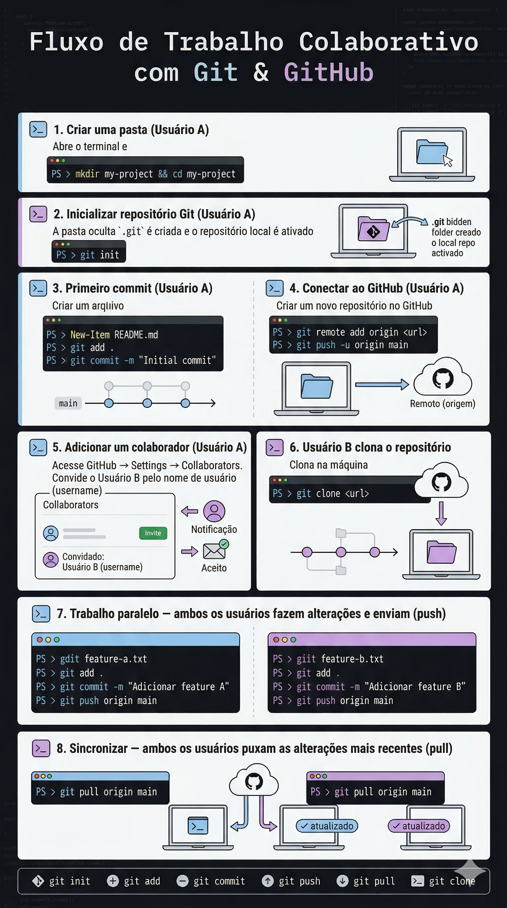

# Aula 08 — Entrega: Trabalho 1 (T1)

> **Disciplina:** Programação para Internet (ILP951)  
> **Professor:** Ronan Adriel Zenatti  
> **Avaliação:** T1 — **2 pontos**  
> **Entrega:** Atividade específica no Google Classroom da turma  
> **Execução:** Individual ou em dupla

---

## 🗺️ O que é este trabalho

O T1 é o primeiro projeto avaliado do semestre. Você vai construir a **estrutura completa de um sistema web com Flask**, aplicando tudo que foi aprendido nas Aulas 01 a 07: organização de projeto, rotas, templates com herança Jinja2, Bootstrap, CSS personalizado e navegação funcional entre páginas.

**Não haverá conexão com banco de dados nesta entrega.** Os dados serão simulados com listas Python diretamente nas rotas, e os formulários, ao serem enviados, devem redirecionar de volta para a listagem — simulando a execução da operação. Toda a navegação deve funcionar de verdade.

---

## 🎯 Tema do Sistema

Você e seu parceiro (ou você individualmente) escolhem o tema do sistema. Ele deve fazer sentido como um sistema de gestão real, com um contexto de negócio claro. O sistema precisa ter:

- Controle de **usuários** (obrigatório)
- Ao menos **mais 2 entidades** com páginas de listagem e inserção

### Exemplos de temas

| Tema | Entidades além de Usuário |
|------|--------------------------|
| 🛒 Loja virtual | Produtos, Categorias |
| 🎬 Catálogo de Filmes e Séries | Filmes/Séries, Gêneros |
| 📚 Biblioteca Digital | Livros, Autores |
| ✅ Gestão de Tarefas | Tarefas, Projetos |
| 🏥 Clínica Médica | Pacientes, Consultas |
| 🎮 Coleção de Games | Jogos, Plataformas |
| 🐾 Pet Shop | Animais, Serviços |
| 🏋️ Academia | Alunos, Planos |
| 🍕 Cardápio de Restaurante | Pratos, Categorias de Prato |
| 🚗 Locadora de Veículos | Veículos, Locações |
| 📦 Controle de Estoque | Produtos, Fornecedores |
| 🎵 Catálogo Musical | Músicas, Álbuns |

Escolha um tema que seja interessante para vocês. Evite repetir exatamente os exemplos de aula.

---

## 📐 Estrutura do Projeto

O projeto deve seguir a estrutura de pastas padrão Flask que foi ensinada:

```
projeto-t1/
│
├── app.py                    ← arquivo principal Flask
├── requirements.txt          ← dependências do projeto
├── .gitignore
│
├── templates/
│   ├── base_publica.html     ← base para páginas públicas (login, cadastro, home)
│   ├── base.html             ← base para páginas após o login (com menu de navegação)
│   ├── index.html            ← página inicial / sobre o negócio
│   ├── login.html
│   ├── cadastro.html         ← cadastro de novo usuário (sem login)
│   │
│   ├── usuarios/
│   │   ├── listar_usuarios.html
│   │   └── inserir_usuario.html
│   │
│   ├── <entidade2>/          ← ex: produtos/, tarefas/, filmes/...
│   │   ├── listar_entidade2.html
│   │   └── inserir_entidade2.html
│   │
│   ├── <entidade3>/
│   │   ├── listar_entidade3.html
│   │   └── inserir_entidade3.html
│   │
│   └── sobre_equipe.html     ← página da equipe de desenvolvimento
│
└── static/
    ├── css/
    │   └── styles.css        ← CSS personalizado obrigatório
    ├── js/
    │   └── scripts.js        ← JavaScript (quando necessário)
    └── imgs/
        └── ...               ← imagens do sistema e fotos da equipe
```

---

## 🗺️ Padrão de Rotas

Todas as rotas devem seguir o padrão abaixo. O nome da tabela/entidade vai no lugar de `<entidade>`.

### Rotas públicas (sem login)

| Método | URL | Função | Descrição |
|--------|-----|--------|-----------|
| GET | `/` | `index()` | Página inicial — sobre o negócio |
| GET | `/login` | `login()` GET | Exibe formulário de login |
| POST | `/login` | `login()` POST | Processa login → redireciona para `/usuarios/listar` |
| GET | `/cadastro` | `cadastro()` GET | Formulário de novo usuário |
| POST | `/cadastro` | `cadastro()` POST | Processa cadastro → redireciona para `/login` |
| GET | `/logout` | `logout()` | Encerra sessão → redireciona para `/login` |

### Rotas protegidas (após login)

| Método | URL | Função | Descrição |
|--------|-----|--------|-----------|
| GET | `/<entidade>/listar` | `listar_<entidade>()` | Lista os registros |
| GET | `/<entidade>/inserir` | `inserir_<entidade>()` GET | Exibe formulário de inserção |
| POST | `/<entidade>/inserir` | `inserir_<entidade>()` POST | Valida campos e redireciona para `/<entidade>/listar` |
| GET | `/equipe` | `equipe()` | Página sobre a equipe de desenvolvimento |

### Exemplo concreto com usuários e produtos

```
GET  /usuarios/listar
GET  /usuarios/inserir
POST /usuarios/inserir      → valida campos obrigatórios → redireciona para /usuarios/listar

GET  /produtos/listar
GET  /produtos/inserir
POST /produtos/inserir      → valida campos obrigatórios → redireciona para /produtos/listar
```

---

## 📄 Páginas obrigatórias e o que deve ter em cada uma

### Página Inicial (`/`)

A página inicial é a vitrine do negócio — ela deve apresentar o sistema para quem ainda não está logado. Pense nela como o site institucional da empresa ou serviço. Deve conter:

- Nome do sistema e do negócio
- Descrição do que o sistema faz e para quem serve
- Seção com as principais funcionalidades (cards, ícones, lista visual)
- Botões de acesso ao login e cadastro
- Footer com o nome dos desenvolvedores

> Exemplo: um sistema de locadora deve apresentar o serviço, as vantagens, talvez os planos disponíveis. Um sistema de academia mostra as modalidades. Um catálogo de filmes mostra os gêneros em destaque.

### Página de Login (`/login`)

- Formulário com campos de e-mail e senha
- Link para a página de cadastro
- Ao submeter (POST): redireciona para `/usuarios/listar`
- Deve usar `base_publica.html` (sem o menu de sistema)

### Página de Cadastro (`/cadastro`)

- Formulário de novo usuário com nome, e-mail, senha e confirmação de senha
- Acessível sem login
- Ao submeter (POST): redireciona para `/login` com flash de sucesso
- Deve usar `base_publica.html`

### Template Base pós-login (`base.html`)

Este é o arquivo mais importante da estrutura. **Todas as páginas acessadas após o login devem herdar deste template**, com exceção da página da equipe. Ele deve conter:

- Navbar com o nome/logo do sistema
- Links de navegação para todas as entidades (Usuários, e as outras 2+)
- Link para a página da Equipe
- Botão/link de Logout
- Bloco `` onde cada página insere seu conteúdo
- Footer com o nome dos desenvolvedores

### Listagem (`/<entidade>/listar`)

- Título da página com o nome da entidade
- Botão "Novo" que leva para `/<entidade>/inserir`
- Tabela Bootstrap com ao menos 4 colunas de dados representativos
- **Dados simulados com lista Python hardcoded na rota** (mínimo 5 registros)
- Coluna de Ações com botões de Editar e Excluir visíveis — os botões devem existir na interface, mas não precisam levar a rotas funcionais nesta entrega
- Deve herdar de `base.html`

### Formulário de Inserção (`/<entidade>/inserir`)

- Formulário com todos os campos relevantes para a entidade
- Campos com `label`, `placeholder` e tipos adequados (`text`, `email`, `number`, `select`, `textarea`, etc.)
- Validação dos campos obrigatórios no back-end antes de redirecionar
- Botões de Salvar e Cancelar (Cancelar volta para a listagem)
- Ao submeter (POST) com dados válidos: redireciona para a listagem com flash de sucesso
- Deve herdar de `base.html`

### Página da Equipe (`/equipe`)

Página obrigatória com as informações dos desenvolvedores. Pode ter estrutura, estilos e layout completamente próprios — **não precisa herdar de nenhum template base**. Para cada integrante deve conter:

- **Foto** (pode ser foto real ou avatar gerado da pessoa)
- **Nome completo**
- **E-mail institucional ou pessoal**
- **Mini bio** (2 a 4 frases sobre você, curso, interesses)

---

## 🎨 Requisitos de Interface

### CSS personalizado (obrigatório)

O arquivo `static/css/styles.css` deve existir e ter ao menos as seguintes personalizações:

- Estilo do rodapé (footer)
- Cores ou tipografia alinhadas à identidade visual do negócio escolhido

### Bootstrap

- Navbar responsiva com colapso em telas pequenas (hamburger)
- Tabelas com classes Bootstrap (`table`, `table-hover`, `table-bordered`)
- Formulários com `form-control`, `form-label` e `form-select`
- Cards para a página da equipe e para a página inicial
- Flash messages estilizadas com alertas Bootstrap
- Grid responsivo (`col-md-*`) onde aplicável

### JavaScript

Dicas de uso para o JavaScript no projeto:

- Confirmação ao clicar no botão Excluir (via `confirm()` ou modal Bootstrap)
- Indicador visual de força de senha no cadastro
- Outro comportamento interativo que enriqueça a experiência

---

## 📋 Checklist de Entrega

Use este checklist antes de submeter. Cada item deve estar funcionando.

### Estrutura e organização
- [ ] Estrutura de pastas correta (`templates/`, `static/`, subpastas por entidade)
- [ ] `requirements.txt` atualizado
- [ ] `.gitignore` com `venv/` e `__pycache__/`
- [ ] Repositório Git com commits ao longo do desenvolvimento (não tudo de uma vez)

### Templates e herança
- [ ] `base_publica.html` existe e é usado por login, cadastro e página inicial
- [ ] `base.html` existe com navbar, menu de navegação e footer
- [ ] Todas as páginas pós-login (exceto `/equipe`) herdam de `base.html` com ``
- [ ] Todos os links usam `url_for()`

### Páginas obrigatórias
- [ ] Página inicial (`/`) sobre o negócio com conteúdo relevante
- [ ] Página de login com formulário funcional
- [ ] Página de cadastro de novo usuário sem login
- [ ] Listagem de usuários com dados simulados (mínimo 5 registros)
- [ ] Formulário de inserção de usuário
- [ ] Listagem e formulário de inserção da 2ª entidade
- [ ] Listagem e formulário de inserção da 3ª entidade
- [ ] Página da equipe com foto, nome, e-mail e mini bio de cada integrante
- [ ] Logout funcional redirecionando para login

### Interface
- [ ] `static/css/styles.css` com regras personalizadas
- [ ] Navbar responsiva funcionando
- [ ] Tabelas Bootstrap nas listagens com botões de Editar e Excluir na coluna de Ações
- [ ] Formulários com `label` e `placeholder` em todos os campos
- [ ] Footer com nome dos desenvolvedores em todas as páginas (exceto `/equipe`, que tem layout próprio)

### Rotas e navegação
- [ ] Padrão de URLs seguido (`/<entidade>/listar`, `/<entidade>/inserir`)
- [ ] POST de inserção valida campos obrigatórios e redireciona para listagem com flash de sucesso
- [ ] Botão Cancelar nos formulários retorna para a listagem

---

## 📦 Como entregar

1. Certifique-se de que o projeto está no repositório GitHub com histórico de commits
2. Acesse a **atividade específica do T1 no Google Classroom** da turma
3. Submeta o **link do repositório GitHub**
4. **Ambos os integrantes da dupla** devem fazer a entrega individualmente no Classroom
5. No campo de comentário da entrega, identifique seu parceiro (se for em dupla): `"Dupla com: [Nome do parceiro]"`

> ⚠️ **Atenção:** entregas feitas apenas por um integrante sem identificação do parceiro nos comentários podem resultar em nota zero para o integrante que não entregou.

---

## 📊 Critérios de Avaliação

O T1 vale **2,0 pontos**, distribuídos em quatro critérios. A avaliação será feita na aula seguinte à entrega, com o aluno demonstrando o sistema em funcionamento e respondendo perguntas sobre o código.

| Critério | Peso | O que será verificado |
|---|---|---|
| **Funcionalidade e navegação** | 0,5 pt | Login, logout e inserção funcionando com redirecionamentos corretos; formulários validando campos obrigatórios no back-end; nenhuma rota gerando erro 500 |
| **Templates e herança** | 0,5 pt | `base.html` e `base_publica.html` bem estruturados; herança aplicada corretamente em todas as páginas obrigatórias; flash messages visíveis; links usando `url_for` |
| **Interface e qualidade visual** | 0,5 pt | Bootstrap aplicado de forma consistente; `styles.css` com personalizações próprias; navbar responsiva; formulários com `label` e `placeholder`; botões de Editar e Excluir presentes nas listagens |
| **Completude e organização** | 0,5 pt | Todas as páginas exigidas presentes e acessíveis; página da equipe com foto, nome, e-mail e bio de cada integrante; estrutura de pastas correta; commits incrementais no Git |

### O que será testado na apresentação

O aluno deve clonar o repositório, instalar as dependências com `pip install -r requirements.txt` e rodar `python app.py` na maquina da Fatec. A demonstração deve percorrer o seguinte roteiro:

1. Acessar a página inicial e apresentar o conteúdo sobre o negócio
2. Fazer o cadastro de um novo usuário e verificar o redirecionamento para o login
3. Fazer login e verificar o redirecionamento para a listagem de usuários
4. Navegar por todas as entidades usando o menu da navbar
5. Simular a inserção de um novo registro em cada entidade e verificar o redirecionamento com flash de sucesso
6. Acessar a página da equipe
7. Fazer logout e verificar o retorno para a tela de login
8. Responder perguntas sobre decisões de código feitas pelo professor

---

## ⚠️ Erros comuns que custam pontos

**Todos os commits no último dia** — o Git mostrará isso claramente. Faça commits incrementais ao longo do desenvolvimento.

**Templates pós-login sem ``** — páginas sem navbar ou rodapé são consideradas incompletas.

**Links com URLs hardcoded** — use sempre `url_for('nome_da_funcao')`. `href="{{ url_for('listar_usuarios') }}"` é o padrão correto.

**Formulários sem `label`** — todos os campos devem ter rótulo com o atributo `for` correspondente ao `id` do campo.

**Página da equipe ausente ou incompleta** — foto, nome, e-mail e bio de cada integrante são obrigatórios.

**Apenas um da dupla entregou** — ambos devem submeter no Classroom.

---
## 📦 Processo de uso do Git e Github pela dupla


---

## 🗓️ Composição da Nota do Semestre

```
Nota Final = T1 + A1 + T2 + A2
```

| Avaliação | Pontos | Quando |
|-----------|--------|--------|
| **T1 — Esta entrega** | 2 pts | Aula 08 |
| A1 — Avaliação Teórica | 3 pts | Aula 09 |
| T2 — Validação Final e Deploy | 2 pts | Aula 17 |
| A2 — Projeto Final | 3 pts | Aula 18 |

O T1 representa 20% da nota final. Aproveite para consolidar tudo que foi aprendido nas primeiras aulas — a preparação para este trabalho é também a preparação para a A1 da próxima aula.

---

> ⬅️ [Voltar ao README](../README.md) | ➡️ [Próxima Aula: Avaliação Teórica A1](Aula_09_Apresentacao_e_Avaliacao_Teorica.md)
